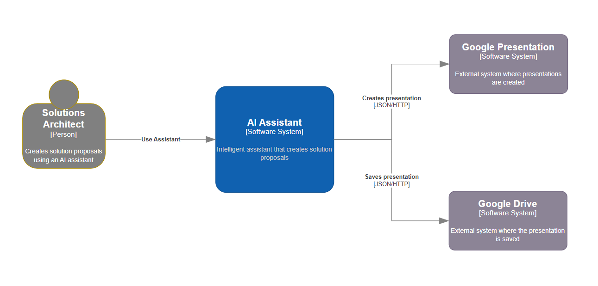

# C4 Model Architecture Assistant for draw.io

An intelligent assistant for creating architecture diagrams using the C4 Model in draw.io. It understands inputs in Portuguese and English, automatically generating accurate and efficient diagrams based on the instructions provided by software architects.

## Summary

- [Overview](#overview): Introduction to the C4 Model Architecture Assistant and its main features.
- [Project Structure](#project-structure): Explanation of project structure to easily contributing.
- [Features](#features): A detailed list of the assistant's capabilities and benefits.
- [Getting Started](#getting-started): Instructions on how to set up and use the assistant.
- [Usage](#usage): Steps to generate diagrams using the assistant and import them into draw.io.
- [Examples](#examples): Sample input and output files to illustrate the assistant's functionality.
- [License](#license): Information about the usage license of this project.
- [Contributing](#contributing): Guidelines on how to contribute to the project and submit issues or pull requests.
- [Contact](#contact): How to reach out for questions, suggestions, or support.

## Overview

The C4 Model Architecture Assistant is a smart tool designed to help software architects easily create architecture diagrams using the C4 Model levels (Context, Containers, Components) directly in draw.io. By processing natural language inputs in both Portuguese and English, this assistant generates well-structured diagrams in XML format, compatible with draw.io.

## Project Structure

The repository is organized as follows:

```markdown
/project-root
  │
  ├── sample_diagrams/        # Sample Diagrams Created│
  ├── referencias-rag/        # External XML Reference Files for Assistant's RAG│
  ├── prompts/                # Sample Prompts to Test Assistant│
  ├── instructions.md         # Instructions for Assistant
```

### Description

- **`sample_diagrams/`**: Contains sample diagrams created using the assistant in XML format, compatible with draw.io. These examples demonstrate the various levels of the C4 Model (Context, Containers, Components).
- **`referencias-rag/`**: Contains external XML reference files that the assistant uses for its retrieval-augmented generation (RAG) process to improve the accuracy and relevance of generated diagrams.
- **`prompts/`**: Contains sample prompts that can be used to test the assistant's capabilities and functionality. These prompts help verify how the assistant generates diagrams based on different inputs.
- **`instructions.md`**: Provides detailed instructions on how to use the assistant, including supported input formats, expected outputs, and guidelines for effective use.
- **`README.md`**: The main project documentation file that includes an overview, features, installation, usage instructions, and contribution guidelines.
- **`LICENSE`**: The license file for the project, outlining the terms under which the project can be used, modified, and distributed.

## Features

- **Multilingual Support**: Understands and processes inputs in both Portuguese and English.
- **Automatic Diagram Generation**: Generates C4 Model diagrams in draw.io format (XML) based on user-provided architectural descriptions.
- **Supports Multiple Levels of the C4 Model**:
  - **Level 1 - Context**: Describes the system, external actors, and their interactions.
  - **Level 2 - Containers**: Details software containers that make up the system and their interactions.
  - **Level 3 - Components**: Shows internal components of each software container and their interactions.
- **Examples and Guidance**: Provides examples and instructions to guide users in creating high-quality diagrams.

### Prerequisites

- [draw.io Desktop Application](https://github.com/jgraph/drawio-desktop) or access to [draw.io Online](https://app.diagrams.net/).

### Installation

1. Clone this repository:

```bash
   git clone https://github.com/fnldesign/c4-model-architecture-assistant.git
   cd c4-model-architecture-assistant
```

## Sample Diagram Created

- Imagem in Draw.IO

  

- XML File .drawio file

```xml
<mxfile host="Electron" agent="Mozilla/5.0 (Windows NT 10.0; Win64; x64) AppleWebKit/537.36 (KHTML, like Gecko) draw.io/24.7.5 Chrome/126.0.6478.183 Electron/31.3.0 Safari/537.36" version="24.7.5">
  <diagram name="C4 Context Diagram" id="MEMCtg0N6xryD90iMHeG">
    <mxGraphModel dx="1616" dy="644" grid="0" gridSize="10" guides="0" tooltips="1" connect="1" arrows="1" fold="1" page="0" pageScale="1" pageWidth="827" pageHeight="1169" math="0" shadow="0">
      <root>
        <mxCell id="0" />
        <mxCell id="1" parent="0" />
        <object placeholders="1" c4Name="Solutions Architect" c4Type="Person" c4Description="Creates solution proposals using an AI assistant" label="&lt;font style=&quot;font-size: 16px&quot;&gt;&lt;b&gt;Solutions Architect&lt;/b&gt;&lt;/font&gt;&lt;div&gt;[Person]&lt;/div&gt;&lt;br&gt;&lt;div&gt;&lt;font style=&quot;font-size: 11px&quot;&gt;&lt;font color=&quot;#fff&quot;&gt;Creates solution proposals using an AI assistant&lt;/font&gt;&lt;/div&gt;" id="Person1">
          <mxCell style="shape=mxgraph.c4.person;whiteSpace=wrap;html=1;fillColor=#808080;strokeColor=#b08f00;align=center;fontColor=#ffffff;" parent="1" vertex="1">
            <mxGeometry x="-5" y="88" width="140" height="150" as="geometry" />
          </mxCell>
        </object>
        <object placeholders="1" c4Name="AI Assistant" c4Type="Software System" c4Description="Intelligent assistant that creates solution proposals" label="&lt;font style=&quot;font-size: 16px&quot;&gt;&lt;b&gt;%c4Name%&lt;/b&gt;&lt;/font&gt;&lt;div&gt;[%c4Type%]&lt;/div&gt;&lt;br&gt;&lt;div&gt;&lt;font style=&quot;font-size: 11px&quot;&gt;&lt;font color=&quot;#cccccc&quot;&gt;%c4Description%&lt;/font&gt;&lt;/div&gt;" id="AIAssistant">
          <mxCell style="rounded=1;whiteSpace=wrap;html=1;labelBackgroundColor=none;fillColor=#1061B0;fontColor=#ffffff;align=center;arcSize=10;strokeColor=#0D5091;metaEdit=1;resizable=0;points=[[0.25,0,0],[0.5,0,0],[0.75,0,0],[1,0.25,0],[1,0.5,0],[1,0.75,0],[0.75,1,0],[0.5,1,0],[0.25,1,0],[0,0.75,0],[0,0.5,0],[0,0.25,0]];" parent="1" vertex="1">
            <mxGeometry x="322" y="99" width="200" height="180" as="geometry" />
          </mxCell>
        </object>
        <object placeholders="1" c4Name="Google Presentation" c4Type="Software System" c4Description="External system where presentations are created" label="&lt;font style=&quot;font-size: 16px&quot;&gt;&lt;b&gt;Google Presentation&lt;/b&gt;&lt;/font&gt;&lt;div&gt;[Software System]&lt;/div&gt;&lt;br&gt;&lt;div&gt;&lt;font style=&quot;font-size: 11px&quot;&gt;&lt;font color=&quot;#fff&quot;&gt;External system where presentations are created&lt;/font&gt;&lt;/div&gt;" id="GooglePresentation">
          <mxCell style="rounded=1;whiteSpace=wrap;html=1;labelBackgroundColor=none;fillColor=#8C8496;fontColor=#ffffff;align=center;arcSize=10;strokeColor=#736782;metaEdit=1;resizable=0;" parent="1" vertex="1">
            <mxGeometry x="718" y="11" width="200" height="100" as="geometry" />
          </mxCell>
        </object>
        <object placeholders="1" c4Name="Google Drive" c4Type="Software System" c4Description="External system where the presentation is saved" label="&lt;font style=&quot;font-size: 16px&quot;&gt;&lt;b&gt;Google Drive&lt;/b&gt;&lt;/font&gt;&lt;div&gt;[Software System]&lt;/div&gt;&lt;br&gt;&lt;div&gt;&lt;font style=&quot;font-size: 11px&quot;&gt;&lt;font color=&quot;#fff&quot;&gt;External system where the presentation is saved&lt;/font&gt;&lt;/div&gt;" id="GoogleDrive">
          <mxCell style="rounded=1;whiteSpace=wrap;html=1;labelBackgroundColor=none;fillColor=#8C8496;fontColor=#ffffff;align=center;arcSize=10;strokeColor=#736782;metaEdit=1;resizable=0;" parent="1" vertex="1">
            <mxGeometry x="717" y="277" width="200" height="100" as="geometry" />
          </mxCell>
        </object>
        <object placeholders="1" c4Type="Relationship" c4Description="Use Assistant" label="&lt;div style=&quot;text-align: left&quot;&gt;&lt;div style=&quot;text-align: center&quot;&gt;&lt;b&gt;%c4Description%&lt;/b&gt;&lt;/div&gt;" id="80exAWO9bLr29MhKa2zx-2">
          <mxCell style="endArrow=blockThin;html=1;fontSize=10;fontColor=#404040;strokeWidth=1;endFill=1;strokeColor=#828282;elbow=vertical;metaEdit=1;endSize=14;startSize=14;jumpStyle=arc;jumpSize=16;rounded=0;edgeStyle=orthogonalEdgeStyle;exitX=1.006;exitY=0.673;exitDx=0;exitDy=0;exitPerimeter=0;entryX=0;entryY=0.5;entryDx=0;entryDy=0;entryPerimeter=0;" edge="1" parent="1" source="Person1" target="AIAssistant">
            <mxGeometry width="240" relative="1" as="geometry">
              <mxPoint x="152" y="13" as="sourcePoint" />
              <mxPoint x="392" y="13" as="targetPoint" />
            </mxGeometry>
          </mxCell>
        </object>
        <object placeholders="1" c4Type="Relationship" c4Technology="JSON/HTTP" c4Description="Creates presentation" label="&lt;div style=&quot;text-align: left&quot;&gt;&lt;div style=&quot;text-align: center&quot;&gt;&lt;b&gt;%c4Description%&lt;/b&gt;&lt;/div&gt;&lt;div style=&quot;text-align: center&quot;&gt;[%c4Technology%]&lt;/div&gt;&lt;/div&gt;" id="80exAWO9bLr29MhKa2zx-3">
          <mxCell style="endArrow=blockThin;html=1;fontSize=10;fontColor=#404040;strokeWidth=1;endFill=1;strokeColor=#828282;elbow=vertical;metaEdit=1;endSize=14;startSize=14;jumpStyle=arc;jumpSize=16;rounded=0;edgeStyle=orthogonalEdgeStyle;entryX=0;entryY=0.5;entryDx=0;entryDy=0;" edge="1" parent="1" source="AIAssistant" target="GooglePresentation">
            <mxGeometry width="240" relative="1" as="geometry">
              <mxPoint x="499" y="-93" as="sourcePoint" />
              <mxPoint x="739" y="-93" as="targetPoint" />
            </mxGeometry>
          </mxCell>
        </object>
        <object placeholders="1" c4Type="Relationship" c4Technology="JSON/HTTP" c4Description="Saves presentation" label="&lt;div style=&quot;text-align: left&quot;&gt;&lt;div style=&quot;text-align: center&quot;&gt;&lt;b&gt;%c4Description%&lt;/b&gt;&lt;/div&gt;&lt;div style=&quot;text-align: center&quot;&gt;[%c4Technology%]&lt;/div&gt;&lt;/div&gt;" id="80exAWO9bLr29MhKa2zx-4">
          <mxCell style="endArrow=blockThin;html=1;fontSize=10;fontColor=#404040;strokeWidth=1;endFill=1;strokeColor=#828282;elbow=vertical;metaEdit=1;endSize=14;startSize=14;jumpStyle=arc;jumpSize=16;rounded=0;edgeStyle=orthogonalEdgeStyle;exitX=1;exitY=0.5;exitDx=0;exitDy=0;exitPerimeter=0;" edge="1" parent="1" source="AIAssistant" target="GoogleDrive">
            <mxGeometry width="240" relative="1" as="geometry">
              <mxPoint x="434" y="384" as="sourcePoint" />
              <mxPoint x="674" y="384" as="targetPoint" />
            </mxGeometry>
          </mxCell>
        </object>
      </root>
    </mxGraphModel>
  </diagram>
</mxfile>
```

## Notes

- This current version don´t automatic integration with draw.io, but print xml in chat and enable to manual export to draw.io.
- For instruction in Custom GPT there are a limit of 8.000 chars, so use external references an text sumarization to deal with this limitation.

## License

This project is licensed under the MIT License. You are free to use, modify, and distribute this software in both private and commercial projects as long as the copyright notice and this license file are included in all copies or substantial portions of the software.

See the [LICENSE](LICENSE) file for more details.

## Contributing

We welcome contributions from the community! If you have suggestions for new features, improvements, or bug fixes, feel free to submit an issue or a pull request. Here's how you can contribute:

1. **Fork the Repository**: Click on the "Fork" button at the top right of this repository page to create a copy of this repository under your GitHub account.

2. **Create a New Branch**: Create a new branch for your changes. Use a descriptive name for the branch (e.g., `feature/add-new-diagram-type`).

   ```bash
   git checkout -b feature/your-feature-name
   ```

3. **Make Your Changes**: Make the necessary changes to the codebase.
Commit Your Changes: Write clear and concise commit messages.

  ```bash
  git commit -m "Add: new diagram type for container-level architecture"
  ```

4. **Push to Your Branch**: Push your changes to the new branch.

```bash
git push origin feature/your-feature-name
```

5. **Open a Pull Request**: Open a pull request to the main branch of this repository, describing your changes and why they should be merged.

## Code of Conduct

Please read the [Code of Conduct](https://chatgpt.com/c/CODE_OF_CONDUCT.md) to understand our guidelines for contributing to this project.

## Contact

If you have any questions, suggestions, or need support, please feel free to reach out:

- **Email**: fnldesign@hotmail.com
- **GitHub Issues**: Open an issue on this repository to report bugs or request new features.
